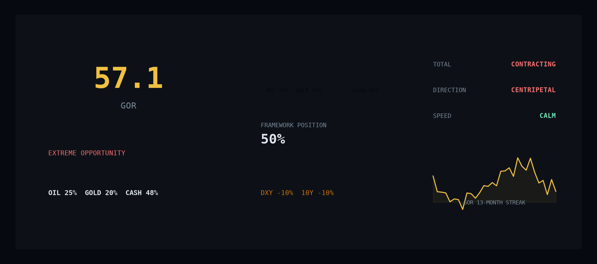

# Deep-Risk-OPP

<p align="center">
  
</p>

<p align="center">
  
  
  
  
  
  
  
</p>

> **One number that tells you when oil is historically cheap.**
> **GOR = Gold ÷ Oil. When it crosses 45, history says oil rallies 54-167% within 12-24 months.**

<p align="center">
  <b>🌐 <a href="https://justinjchen-cornell.github.io/Deep-Risk-OPP/">Live Site</a></b>
  &nbsp;|&nbsp;
  <b>🇨🇳 <a href="https://justinjchen-cornell.github.io/Deep-Risk-OPP/zh/">中文版</a></b>
  &nbsp;|&nbsp;
  <b>🌐 <a href="https://justinjchen-cornell.github.io/Deep-Risk-OPP/en/">English</a></b>
  &nbsp;|&nbsp;
  <b>📡 <a href="https://justinjchen-cornell.github.io/Deep-Risk-OPP/dashboard.html">Dashboard</a></b>
  &nbsp;|&nbsp;
  <b>📈 <a href="docs/track-record.md">Track Record</a></b>
</p>

---

## What Is This?

**Deep-Risk-OPP** turns one ratio into a daily macro decision. It watches the Gold/Oil Ratio (GOR) as a seismograph for systemic stress, maps global capital flows as fault-line scans, and runs 11 decision frameworks + 6 legendary-investor mindsets through a priority engine — producing a single allocation card every day, published automatically to a public website.

- **The claim**: GOR ≥ 45 has never failed to precede oil gains of 54-167% over the following 12-24 months (1998, 2008, 2016, 2020).
- **The state (Aug 2026)**: GOR(WTI) = 53.8 — its 13th consecutive month above 45, the longest stretch in recorded history. Gold $4,454/oz, WTI $82.75.
- **The output**: a live bilingual website updated daily by GitHub Actions. Zero black-box AI. Every threshold is in `config.py`.

Acknowledgments: The gold-to-oil ratio theory derives from Mr. Lu Qiyuan's macro analysis system. The "Three Capital Flows" framework draws on liquidity models by various analysts. The "Six Masters Mapping" is the author's synthesis of six investors' public statements. Hard stops, risk modifiers, automation, and Claude Code integration are original work. Data: FRED, akshare, yfinance.

---

## The Live Site

```
index.html (language chooser)
   ├── zh/index.html  ── 中文指挥中心 ──┐
   └── en/index.html  ── EN Command Center ──┤
                                            ▼
        ┌──────────────────────────────────────────────┐
        │  📡 GOR Live Dashboard   — 全市场实时读数+仓位   │
        │  📊 Decision Board       — GOR区间+硬规则+框架   │
        │  🌊 Capital Flows        — 三流断层扫描         │
        │  🛡️ Hedge Playbook       — 五策略对冲工具箱      │
        │  📈 Track Record         — 实盘记录（含认错）    │
        └──────────────────────────────────────────────┘
```

- **Every page** carries a unified HUD navigation bar with a live GOR badge — jump between pages from anywhere.
- **Every page fetches `gor_latest.json` on load** — the data you see is always the latest daily run.
- **Data pipeline**: GitHub Actions cron (00:00 UTC) → fetch FRED/akshare/yfinance → compute GOR + allocation → commit JSON → auto-deploy to GitHub Pages. Zero manual steps.

---

## The Core Metaphor

```
┌──────────────────────────────────────────────────────────────┐
│                                                              │
│   SURFACE LAYER (what everyone sees)                         │
│   ▓▓▓▓▓▓▓▓▓▓▓▓▓▓▓▓▓▓▓▓▓▓▓▓▓▓▓▓▓▓▓▓▓▓▓▓▓▓▓▓▓▓▓▓▓▓▓▓▓▓▓▓   │
│   Prices. Headlines. CPI prints. Fed minutes.               │
│                                                              │
│   ──────────────────── ⚡ FRACTURE ⚡ ────────────────────    │
│                                                              │
│   DEEP LAYER (what Deep-Risk-OPP sees)                      │
│   ▓▓▓▓▓▓▓▓▓▓▓▓▓▓▓▓▓▓▓▓▓▓▓▓▓▓▓▓▓▓▓▓▓▓▓▓▓▓▓▓▓▓▓▓▓▓▓▓▓▓▓▓   │
│   GOR divergence. Capital centripetal collapse.             │
│   Supply-chain severance. Liquidity freeze.                 │
│                                                              │
│   The system detects stress accumulating in the deep layer  │
│   BEFORE it erupts through the surface.                     │
│                                                              │
│   Seismograph: GOR ratio (Gold/Oil)                         │
│   Fault scan:  Capital Three-Flows (Total/Direction/Speed)  │
│   Analysts:    11 frameworks + 6 investment masters         │
│   Output:      1 early-warning decision card                │
│                                                              │
└──────────────────────────────────────────────────────────────┘
```

---

## The Seismograph: GOR Zones

| Zone | GOR Range | Risk Signal | Action |
|------|:---------:|-------------|--------|
| 🔴 **Extreme Opportunity** | ≥ 45 | Oil deeply undervalued. Structural mean-reversion building. | Accumulate energy. Reduce gold. |
| 🟠 **Recovery Cycle** | 30–45 | Ratio normalizing. Crisis abating. | Hold. Let the trade work. |
| 🟢 **Fair Value** | 20–30 | Historical equilibrium. No structural mispricing. | Light positions. Wait. |
| 🔵 **Oil Bubble** | < 20 | Gold cheap. Oil expensive. Inflation fear peaked. | Cash + gold. No energy exposure. |

### Circuit Breakers (Non-Negotiable)

| Breaker | Condition | Action |
|---------|:--------:|--------|
| WTI Hard Stop | WTI < $75 | Oil forced ≤ 5% |
| DXY Surge | DXY > 99 | Total position -10% |
| Rate Spike | 10Y > 4.3% | Total position -10% |
| Vol Explosion | VIX > 25 | All risk positions -50% |
| PBoC Floor | Monthly gold buy ≥ 2T | Gold floor locked ≥ 15% |

---

## The Fault-Line Scan: Capital Three-Flows

| Dimension | What It Measures | Current (Aug 2026) |
|-----------|-----------------|--------------------|
| **Total** | Global liquidity: expanding or contracting? | 🔴 Contracting (Fed QT, BS $6.75T) |
| **Direction** | Capital flowing to USD or away? | 🔴 Centripetal (DXY 100.0) |
| **Speed** | Panic or calm? | 🟡 Calm (VIX 15.3) |

**Centripetal Collapse Alert**: When Total contracts + Direction pulls inward + Speed accelerates → systemic liquidity event is imminent. Current speed is calm — the collapse is building in slow motion.


---

## The 11 Frameworks

Every framework answers one question. Together they form a 360-degree risk assessment.

| # | Framework | Core Question | Trigger | File |
|:-:|-----------|--------------|:------:|------|
| 01 | **GOR Direction** | What to allocate today? | Daily | [frameworks/01-GOR方向框架.md](frameworks/01-GOR方向框架.md) |
| 02 | **Deep Diligence** | Which specific asset? | On-demand | [frameworks/02-个股四维研判.md](frameworks/02-个股四维研判.md) |
| 03 | **Bagholder Theory** | What market phase are we in? | Event | [frameworks/03-接盘论框架.md](frameworks/03-接盘论框架.md) |
| 04 | **Token Dollar** | Where is USD hegemony? | Monthly | [frameworks/04-Token美元进度.md](frameworks/04-Token美元进度.md) |
| 05 | **Hedging Strategy** | How to protect positions? | Per position | [frameworks/05-对冲策略选择.md](frameworks/05-对冲策略选择.md) |
| 06 | **Risk Calendar** | What time nodes lie ahead? | Weekly | [frameworks/06-风控日历.md](frameworks/06-风控日历.md) |
| 07 | **Decision Audit** | Was that luck or skill? | Monthly | [frameworks/07-决策审计框架.md](frameworks/07-决策审计框架.md) |
| 08 | **Six Masters** | What would the legends say? | Events | [frameworks/08-六大师映射.md](frameworks/08-六大师映射.md) |
| 09 | **Capacity Cycle** | Where in the industrial cycle? | On-demand | [frameworks/09-产能周期框架.md](frameworks/09-产能周期框架.md) |
| 10 | **Catalyst Calendar** | What events will move markets? | On-demand | [frameworks/10-催化剂日历框架.md](frameworks/10-催化剂日历框架.md) |
| 11 | **Capital Three Flows** | Where is money flowing? | Daily+Weekly | [frameworks/11-资本三流框架.md](frameworks/11-资本三流框架.md) |
| 12 | **Miners Lead** *(validation layer)* | Are miners confirming the commodity supercycle? | Weekly | [frameworks/12-矿业股领先指标.md](frameworks/12-矿业股领先指标.md) |

### Priority Chain (When Frameworks Conflict)

```
Level 1: Circuit Breaker      — WTI < $75 → oil forced ≤ 5%
Level 2: Risk Calendar Node   — FOMC / OPEC+ / election overrides
Level 3: Bagholder >= 7       — All positions × 0.7
Level 4: Capital Flow Signal  — Centripetal → raise cash ≥ 40%
Level 5: GOR Direction        — Default allocation baseline
Level 6: Master Consensus     — Advisory only, does not override
```

Lower number = higher priority. Circuit breakers always win.

---

## The 6 Masters

Not predictions. **Risk philosophies.** Each master's framework is mapped onto current data to produce a risk posture (refreshed in the monthly audit).

| Master | Risk Philosophy | Posture (latest scan) | Signal |
|--------|----------------|----------------------|:------:|
| **Buffett** | "Be fearful when others are greedy." $397B in cash. | Cash is the position. Energy is the watchlist. | DEFENSIVE |
| **Burry** | "The bond market is screaming." 30Y at 5.24%. | Systemic credit event brewing. | DEFENSIVE |
| **Druckenmiller** | "Liquidity drives everything." Three CBs tightening. | Tactical oil long. Strategic cash. | SELECTIVE |
| **Damodaran** | "Price is what you pay. Value is what you get." | Energy majors 40% undervalued. Gold 32% overvalued. | BULLISH ENERGY |
| **Taleb** | "The tails are fat." Hallmuz + BOJ + US auction risks. | Barbell: 90% ultra-safe + 10% convex bets. | HEDGED |
| **Li Ka-shing** | "未买先想卖." 90% of brain on what can go wrong. | Direction is right. Sweetest fruit already picked at GOR=78. Wait for forced sellers. | PATIENT |

For detailed master mappings, see [frameworks/08-六大师映射.md](frameworks/08-六大师映射.md).

---

## System Architecture

```
   DATA SOURCES                      PIPELINE                      OUTPUT
┌──────────────┐   ┌────────────────────┐   ┌──────────────────────────────┐
│ FRED (Fed)   │   │  gor_daily.py      │   │  gor_latest.json             │
│ akshare      │──▶│  (GitHub Actions    │──▶│  capital_flows_latest.json   │
│ yfinance     │   │   cron, 00:00 UTC)  │   │  wti_history.json            │
└──────────────┘   │  Pull → Compute GOR │   │  ALERT_YYYY-MM-DD.md         │
                   │  → Classify → Save  │   └──────────────┬───────────────┘
                   └────────────────────┘                  │ auto-deploy
                                                           ▼
   ┌─────────────────────────────────────────────────────────────────────┐
   │  run.py decision engine (8 modes)          Pages site (all pages    │
   │  frameworks → priority chain → card        fetch JSON on load)      │
   └─────────────────────────────────────────────────────────────────────┘
```

1. **Data layer** — FRED (12 macro series), akshare (commodities), yfinance (DXY), each with fallbacks.
2. **Daily pipeline** — `scripts/gor_daily.py` runs on GitHub Actions at 00:00 UTC, writes fresh JSONs, commits them, and Pages auto-deploys.
3. **Decision engine** — `run.py` loads the 11 frameworks, applies the priority chain, and outputs the daily decision card.
4. **Presentation** — every web page fetches `gor_latest.json` on load; embedded data blocks serve as offline fallback.

---

## Subscribe (free)

Never check the site again — let the signal come to you:

| Channel | How |
|---|---|
| 📮 **Email** | [buttondown.com/chenjia2007](https://buttondown.com/chenjia2007) — one email every morning |
| 🔔 **RSS to email** | [follow.it/deep-risk-opp](https://follow.it/deep-risk-opp?leanpub) |
| 📡 **Raw RSS** | [feed.xml](https://justinjchen-cornell.github.io/Deep-Risk-OPP/feed.xml) — any reader |
| 📱 **PWA** | open the site on your phone → "Add to Home Screen" |

Daily pipeline: 00:00 UTC data pull → signal → push to configured channels (Feishu/DingTalk/ServerChan/Telegram) → RSS → auto-deploy.

## Getting Started

**Level 0 — just look.** No installation. Open the [live site](https://justinjchen-cornell.github.io/Deep-Risk-OPP/) — it updates itself daily.

**Level 1 — run the data pipeline locally.**

```bash
git clone https://github.com/Justinjchen-Cornell/Deep-Risk-OPP.git
cd Deep-Risk-OPP
pip install -r requirements.txt

# create .env with your API keys (see "API Keys" below)
python scripts/gor_daily.py        # one full daily update
```

**Level 2 — run the decision engine.**

```bash
python run.py --mode daily                         # today's signal card
python run.py --mode masters        # all six master postures on current data
python run.py --mode weekly --compare last-week    # weekly change report
python run.py --mode backtest --from 2020-01 --to 2026-08
```

**Level 3 — natural language (via Claude Code).**

```
"What's the macro risk posture today?"      → GOR + flows + calendar card
"Hedge my oil position."                    → WTI $75 Put recommendation
"Is this a market top?"                     → Bagholder 10-point checklist
"Should I rotate from gold to oil?"         → GOR + masters + flows cross-check
"What did we get right and wrong last month?" → decision audit scores
```

Prerequisites: Python ≥ 3.11; Claude Code only for Level 3.


---

## Configuration

```python
# config.py — Shared parameters for all frameworks

# GOR Seismograph
GOR_EXTREME = 45          # Extreme opportunity threshold
GOR_RECOVERY = 30         # Recovery cycle floor
GOR_FAIR_VALUE = 20       # Fair value floor

# Circuit Breakers
WTI_HARD_STOP = 75        # Oil forced ≤ 5% below this
DXY_THRESHOLD = 99        # Strong USD: total position -10%
YIELD_THRESHOLD = 4.3     # High rates: total position -10%
VIX_PANIC = 25            # Vol explosion: risk positions -50%

# Priority Weights
CIRCUIT_BREAKER_PRIORITY = 1    # Always wins
RISK_CALENDAR_PRIORITY = 2
BAGHOLDER_PRIORITY = 3
CAPITAL_FLOW_PRIORITY = 4
GOR_DIRECTION_PRIORITY = 5
MASTER_CONSENSUS_PRIORITY = 6

# Data Sources (3-layer: FRED primary → yfinance → web fallback)
GOLD_SOURCE = "akshare (GC=F)"
WTI_SOURCE = "akshare (CL=F)"
DXY_SOURCE = "yfinance (DX-Y.NYB) + web fallback"
YIELD_10Y_SOURCE = "FRED (DGS10) + akshare fallback"
YIELD_30Y_SOURCE = "FRED (DGS30)"
VIX_SOURCE = "FRED (VIXCLS) + TradingView/CBOE fallback"
FED_SOURCE = "FRED (DFF/WALCL/M2SL/CPIAUCSL/PCEPILFE/GFDEBTN)"
```

Full configuration guide: [config.py](config.py)

---

## API Keys

The daily pipeline needs two free API keys. Register them yourself — each takes ~2 minutes:

| Key | Service | Register at | Used for |
|-----|---------|-------------|----------|
| `FRED_API_KEY` | FRED (Federal Reserve Economic Data, St. Louis Fed) | https://fred.stlouisfed.org/docs/api/api_key.html | US macro series: DGS10/30, DFF, WALCL, M2SL, VIXCLS, CPI, PCE, debt |
| `OPENFIGI_API_KEY` | Bloomberg OpenFIGI | https://www.openfigi.com/user/profile | Security identifier mapping (ticker/ISIN/CUSIP → FIGI), A/H-share cross-reference |
| `ADANOS_API_KEY` | Adanos Reddit sentiment *(optional, local only)* | See its official site (api.adanos.org) | Reddit sentiment scan (`--mode sentiment`) |

**Local setup** — create `.env` in the project root (never committed):

```bash
FRED_API_KEY=your-32-char-hex-key
OPENFIGI_API_KEY=your-uuid-key
ADANOS_API_KEY=sk_your-key    # optional
```

**GitHub Actions setup** (for the daily auto-update) — add two repository secrets at
*Settings → Secrets and variables → Actions → New repository secret*:

- `FRED_API_KEY`
- `OPENFIGI_API_KEY`

Key formats: FRED = 32-char lowercase hex; OpenFIGI = UUID. Both are free-tier,
read-only data keys — safe to store as Actions secrets (encrypted at rest, masked in
logs). You can rotate them anytime from each provider's site.

---

## Track Record

Signals and outcomes are public — including the mistakes. See the full record: [docs/track-record.md](docs/track-record.md)

| Date | GOR | Signal | Subsequent Market Move | ✓ |
|------|----:|--------|------------------------|:-:|
| 2020.04 | 69.5 | Extreme: accumulate oil | WTI +167% in 12 months | ✅ |
| 2016.01 | ~39 | Recovery: hold oil | WTI +54% in 12 months | ✅ |
| 2008.12 | ~30 | Recovery: hold oil | WTI +78% in 12 months | ✅ |
| **2026.06.25** | 53.33 | **Circuit breaker: WTI < $75 → oil 5%** | WTI fell to $68.76. Capital preserved. | ✅ |
| **2026.07.15** | 50.85 | **Hard stop released. Accumulate oil 27%.** | In progress — WTI reclaimed $79.49 in 72h. | ⏳ |

*Past signals are backtested on historical data. Real-time signals are tracked live.* Daily snapshots and alerts are archived locally and auditable in commit history.

---

## File Structure

```
Deep-Risk-OPP/
├── index.html                  # Language chooser landing
├── dashboard.html              # 📡 Live GOR dashboard (fetch JSON)
├── 📊 投资决策看板.html          # 中文决策看板（动态渲染）
├── 🌊 资本三流观测站.html        # 中文资本三流（含LIVE数据条）
├── 🛡️ 对冲作战手册.html         # 中文对冲手册（动态渲染）
├── zh/index.html               # 中文Hub（指挥中心）
├── en/                         # English hub + 3 pages
├── gor_latest.json             # Latest signal (auto-updated daily)
├── capital_flows_latest.json   # Latest capital flows (auto-updated)
├── wti_history.json            # Rolling WTI history → dynamic hard stop
├── config.py                   # All thresholds & parameters
├── run.py                      # CLI decision engine (8 modes)
├── scripts/
│   ├── gor_daily.py            # Daily pipeline (Actions cron 00:00 UTC)
│   ├── weekly_data_pull.py     # Weekly change report generator
│   └── figi_mapper.py          # OpenFIGI identifier mapping
├── frameworks/                 # 11 decision frameworks (zh)
├── docs/
│   ├── track-record.md         # Live track record (incl. mistakes)
│   ├── promo-pack.md           # Launch copy for social platforms
│   └── code_review_2026-08.md  # First systematic code review
├── 看板日志/ (local only)       # Daily snapshots & alerts — gitignored
└── .github/workflows/
    ├── daily.yml               # Daily data update
    └── static.yml              # GitHub Pages deploy
```


---

## Roadmap

| Milestone | Description | Status |
|-----------|-------------|:------:|
| v1.0 | GOR seismograph + daily signal card | ✅ Shipped |
| v1.1 | Capital flow fault-line scan integration | ✅ Shipped |
| v1.2 | Six masters mapping + consensus engine | ✅ Shipped |
| v1.3 | Second/third-order opportunity detection | ✅ Shipped |
| v2.0 | Full priority chain with circuit breakers | ✅ Shipped |
| v2.1 | Weekly automated change reports + dynamic hard stop (60D SMA × 0.85) | ✅ Shipped |
| v2.2 | Public product: bilingual live site + daily auto pipeline + unified HUD nav | ✅ Shipped (Aug 2026) |
| v2.3 | Historical backtest suite (2000–2026) | 🔄 In progress |
| v2.4 | Codebase health: split `run.py` into `modes/`, merge `gor_daily` + `weekly_data_pull`, pytest for core functions, refresh risk calendar | 🔄 In progress |
| v2.5 | Sentiment (Adanos) merged into main JSON · config schema validation · unified charting entry | 📋 Next |
| v2.6 | Mining-stock leading indicators (GDX / COPX / XAU-Gold ratio / silver) tracked in daily pipeline | 📋 Next |
| v3.0 | Real-time alerting (email/webhook push on breaker triggers) | 📋 Next |
| v4.0 | Multi-asset portfolio simulation | 📋 Later |

**🚀 Product launch (in progress)**: Xueqiu debut · LinkedIn GOR Pulse #004 · HelloGitHub · Hacker News Show HN · X hook thread — launch copy in [docs/promo-pack.md](docs/promo-pack.md).

---

## Contributing

Deep-Risk-OPP is a personal research framework shared openly. If you want to:

- **Report a bug**: Open an issue with the signal date and framework involved.
- **Suggest a framework**: Propose a new decision framework with its core question and trigger logic.
- **Improve the backtest**: Submit a PR with verified historical data and methodology.
- **Translate**: English and Chinese are maintained. Other languages welcome.

All framework parameters are in `config.py`. Circuit breaker thresholds should only be changed with strong historical evidence.

---

## Disclaimer

```
DEEP-RISK-OPP IS A MACRO RESEARCH FRAMEWORK — NOT INVESTMENT ADVICE.

This system is a tool for structural risk awareness and scenario analysis.
It does not predict market movements. It does not recommend specific securities.
It does not guarantee outcomes. All signals are probabilistic, not deterministic.

The GOR ratio, capital flow scans, master consensus, and all framework outputs
are research artifacts. They carry no warranty of accuracy.

Past signals and backtests do not guarantee future results.
All investment decisions remain entirely your responsibility.

By using this framework, you acknowledge that you are engaging with
independent macro research — not receiving financial advice.
```

---

## License

MIT © 2026 Justin Chen (Justinjchen-Cornell)

---

## Credits

Deep-Risk-OPP synthesizes insights from:

- **Gold/Oil Ratio theory** — a single-ratio macro allocation framework
- **Capital Three-Flows theory** (资本三流) — global liquidity total/direction/speed analysis
- **The Centripetal Collapse thesis** (向心坍缩) — structural USD liquidity concentration
- **Six legendary investors** — Buffett, Burry, Druckenmiller, Damodaran, Taleb, Li Ka-shing
- **Claude Code** — the AI platform that makes multi-framework orchestration possible

Built with Python, Claude MCP, Yahoo Finance API, CBOE, FRED, and ICE data.

---

> *"The GOR ratio is the seismograph. Capital flows are the fault-line scan. The frameworks are the analysts. Deep-Risk-OPP is the early-warning system. What you do with the signal — that's yours."*
