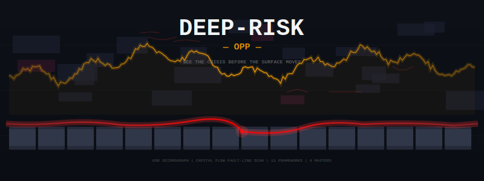

# Deep-Risk-OPP

<p align="center">
  
</p>

<p align="center">
  
  
  
  
  
</p>

> **在表层移动之前，看见危机。在人群涌入之前，发现机会。**
>
> *See the crisis before the surface moves. Find the opportunity before the crowd arrives.*

```
GOR地震仪 → 资本流断层扫描 → 11个框架 → 6位大师 → 1张决策卡
```
鸣谢：本框架的金油比理论基础来自卢麒元先生的宏观分析体系。资本三流框架借鉴了多位分析师的流动性分析框架。六大师映射是作者对六位投资大师公开言论的归纳。硬止损规则、风险修正器、Python 自动化管道和 Claude Code 集成由作者独立构建。所有数据来自公开 API（FRED、akshare、yfinance）。
---

## 这是什么？

**Deep-Risk-OPP** 是一个为 Claude Code 构建的开源宏观预警系统。它只回答一个问题：

> *"表层之下，什么结构性风险正在积累——而机会又藏在哪里？"*

大多数人盯着价格。Deep-Risk-OPP 盯着**价格之下的断裂**。它把金油比（GOR）当作探测系统性压力的**地震仪**，把全球资本流动当作**断层扫描**，通过优先级引擎调度11个决策框架，最终产出一张信号卡。

**OPP** 代表 **Opportunity（机会）**——因为深度风险，被正确解读之后，就是深度机会的藏身之处。

---

## 核心隐喻

```
┌──────────────────────────────────────────────────────────────┐
│                                                              │
│   表层（人人都能看到）                                         │
│   ▓▓▓▓▓▓▓▓▓▓▓▓▓▓▓▓▓▓▓▓▓▓▓▓▓▓▓▓▓▓▓▓▓▓▓▓▓▓▓▓▓▓▓▓▓▓▓▓▓▓▓▓   │
│   价格。头条。CPI数据。美联储纪要。                                │
│                                                              │
│   ──────────────────── ⚡ 断裂层 ⚡ ────────────────────       │
│                                                              │
│   深层（Deep-Risk-OPP 看到的）                                │
│   ▓▓▓▓▓▓▓▓▓▓▓▓▓▓▓▓▓▓▓▓▓▓▓▓▓▓▓▓▓▓▓▓▓▓▓▓▓▓▓▓▓▓▓▓▓▓▓▓▓▓▓▓   │
│   GOR极端偏离。资本向心坍缩。供应链断裂。流动性冻结。             │
│                                                              │
│   系统在深层应力积累的早期就捕捉到信号——                          │
│   在它冲破表层之前。                                           │
│                                                              │
│   地震仪：GOR金油比                                           │
│   断层扫描：资本三流（总量/方向/流速）                           │
│   分析师：11个决策框架 + 6位投资大师                            │
│   输出：1张预警决策卡                                          │
│                                                              │
└──────────────────────────────────────────────────────────────┘
```

---

## 快速开始

```bash
git clone https://github.com/Justinjchen-Cornell/Deep-Risk-OPP.git
cd Deep-Risk-OPP

pip install -r requirements.txt

# 每日信号
python run.py --mode daily

# 或直接问 Claude Code
# "运行Deep-Risk。今天的风险信号是什么？"
```

**前置条件**：Claude Code（含 MCP server）。Python >= 3.11。

---

## 系统架构

```
用户: "今天的宏观风险是什么？"
          │
          ▼
┌─────────────────────────────────────────────────────┐
│             DEEP-RISK-OPP 管道                       │
├─────────────────────────────────────────────────────┤
│                                                      │
│  [1] 地震仪                                           │
│      GOR = 黄金($/oz) ÷ WTI($/bbl)                  │
│      判定区间：极端机会 / 修复周期 / 均衡 / 泡沫        │
│                                                      │
│  [2] 断层扫描                                         │
│      资本三流：总量 × 方向 × 流速                       │
│      判定：向心坍缩 / 离心扩散                          │
│                                                      │
│  [3] 框架调度                                         │
│      加载11个框架。优先级链裁决冲突。信号共识计算。      │
│                                                      │
│  [4] 大师咨询                                         │
│      6位传奇投资人的思维模型映射到当前数据。              │
│      巴菲特说持币？伯里说对冲？李嘉诚说等强制卖家？       │
│                                                      │
│  [5] 信号输出                                         │
│      1张决策卡。6行结论。零模糊。                       │
│                                                      │
└─────────────────────────────────────────────────────┘
          │
          ▼
┌──────────────────────┐
│   预警决策卡          │
│   日期: 2026-07-15   │
│   GOR:   50.85       │
│   风险:  升高中       │
│   油气:  低吸27%     │
│   黄金:  持有15%     │
│   现金:  50%+        │
│   警报:  Warsh鹰派   │
└──────────────────────┘
```

---

## 11个决策框架

每个框架回答一个问题。合在一起构成360度风险评估。

| # | 框架 | 核心问题 | 触发频率 | 文件 |
|:-:|------|---------|:------:|------|
| 01 | **GOR方向判定** | 今天该配什么方向？ | 每日 | [01-GOR方向框架.md](01-GOR方向框架.md) |
| 02 | **个股四维研判** | 具体选哪个标的？ | 按需 | [02-个股四维研判.md](02-个股四维研判.md) |
| 03 | **接盘论** | 市场处于什么阶段？ | 事件驱动 | [03-接盘论框架.md](03-接盘论框架.md) |
| 04 | **Token美元** | 美元霸权走到哪了？ | 月度 | [04-Token美元进度.md](04-Token美元进度.md) |
| 05 | **对冲策略** | 仓位怎么保护？ | 按仓位 | [05-对冲策略选择.md](05-对冲策略选择.md) |
| 06 | **风控日历** | 前面有什么时间节点？ | 每周 | [06-风控日历.md](06-风控日历.md) |
| 07 | **决策审计** | 对的是运气还是能力？ | 月度 | [07-决策审计框架.md](07-决策审计框架.md) |
| 08 | **六大师映射** | 大师们会说什么？ | 事件 | [08-六大师映射.md](08-六大师映射.md) |
| 09 | **产能周期** | 产业周期到哪了？ | 按需 | [09-产能周期框架.md](09-产能周期框架.md) |
| 10 | **催化剂日历** | 什么事件会推动市场？ | 按需 | [10-催化剂日历框架.md](10-催化剂日历框架.md) |
| 11 | **资本三流** | 钱在往哪流？ | 每日+每周 | [11-资本三流框架.md](11-资本三流框架.md) |

### 优先级链（框架冲突时）

```
第一级：熔断器        — WTI < $75 → 油气强制 ≤ 5%
第二级：风控日历节点   — FOMC / OPEC+ / 选举日最高优先
第三级：接盘论 >= 7    — 所有仓位 × 0.7
第四级：资本流信号     — 向心坍缩 → 现金升至 ≥ 40%
第五级：GOR方向       — 默认配置基准
第六级：大师共识       — 仅参考，不覆盖
```

数字越小，优先级越高。熔断器永远取胜。

---

## 6位投资大师

不是预测。是**风险哲学**。每位大师的思维框架被映射到当前数据上，产出一个风险姿态。

| 大师 | 风险哲学 | 当前姿态 (2026年7月) | 信号 |
|------|---------|-------------------|:--:|
| **巴菲特** | "别人贪婪时恐惧。" 持有3970亿美元现金。 | 现金就是仓位。能源在观察名单上。 | 防御 |
| **伯里** | "债券市场在尖叫。" 30年期收益率5.15%。 | 系统性信用事件在酝酿。 | 防御 |
| **德鲁肯米勒** | "流动性驱动一切。" 三大央行同时抽水。 | 战术性做多原油。战略性持币。 | 选择性 |
| **达摩达兰** | "价格是你付出的，价值是你得到的。" | 能源巨头低估40%。黄金高估32%。 | 看多能源 |
| **塔勒布** | "尾部很肥。" 霍尔木兹+日本央行+美债拍卖。 | 杠铃：90%超安全 + 10%凸性押注。 | 对冲态 |
| **李嘉诚** | "未买先想卖。" 90%的脑力想什么会出错。 | 方向对。最甜的果子在GOR=78时已被摘走。等强制卖家出现。 | 耐心 |

详见 [08-六大师映射.md](08-六大师映射.md)。

---

## 使用示例

```bash
# 每日宏观风险扫描
python run.py --mode daily

# 指定框架运行
python run.py --mode daily --frameworks 01,05,11

# 大师们对当前数据怎么说？
python run.py --mode masters --masters buffett,burry,taleb

# 生成周度变化比对报告
python run.py --mode weekly --compare last-week

# 历史回测
python run.py --mode backtest --from 2020-01 --to 2026-07

# 导出决策卡 JSON
python run.py --mode daily --output signal.json
```

### 自然语言（通过 Claude Code）

```
用户: "Deep-Risk：今天的宏观风险姿态？"
→ 加载 GOR + 资本三流 + 风控日历。输出决策卡。

用户: "对冲我的油气仓位。"
→ 加载 对冲策略 + 风控日历。推荐 WTI $75 Put。

用户: "这是不是市场顶部？"
→ 加载 接盘论。执行 10 分制检查清单。

用户: "黄金要不要转原油？"
→ 加载 GOR + 六大师 + 资本三流。交叉验证。

用户: "上个月我们对的和错的分别是什么？"
→ 加载 决策审计。对框架准确性进行评分。
```

---

## 地震仪：GOR四大区间

| 区间 | GOR范围 | 风险信号 | 操作方向 |
|------|:------:|---------|--------|
| 🔴 **极端机会** | ≥ 45 | 原油被深度低估。结构性均值回归蓄力中。 | 做多能源。减持黄金。 |
| 🟠 **修复周期** | 30–45 | 比率在正常化。危机消退中。 | 持有。让交易运作。 |
| 🟢 **估值均衡** | 20–30 | 历史均衡区。无结构性错配。 | 轻仓。等待。 |
| 🔵 **原油泡沫** | < 20 | 黄金便宜，原油昂贵。通胀恐慌见顶。 | 现金+黄金。不入能源。 |

### 熔断器（不可谈判）

| 熔断条件 | 触发线 | 动作 |
|---------|:-----:|------|
| WTI硬止损 | WTI < $75 | 油气强制 ≤ 5% |
| 美元飙升 | DXY > 99 | 总仓位 -10% |
| 利率飙升 | 10Y > 4.3% | 总仓位 -10% |
| 恐慌爆发 | VIX > 25 | 所有风险仓位 -50% |
| 央行托底 | PBoC月度购金 ≥ 2吨 | 黄金底仓锁定 ≥ 15% |

---

## 断层扫描：资本三流

| 维度 | 测量什么 | 当前状态 (2026年7月) |
|------|---------|-------------------|
| **总量** | 全球流动性：扩张还是收缩？ | 🔴 收缩中 (Fed QT $7.3万亿) |
| **方向** | 资本流向美元还是流出？ | 🔴 向心坍缩 (DXY 100.96) |
| **流速** | 恐慌还是平静？ | 🟡 放缓中 (VIX 15.03) |

**向心坍缩警报**：当总量收缩 + 方向向内 + 流速加速 → 系统性流动性事件迫在眉睫。

---

## 实盘验证

GOR地震仪的历史信号回测精选：

| 日期 | GOR | 信号 | 后续市场走势 | ✓ |
|------|----:|------|------------|:-:|
| 2020.04 | 69.5 | 极端：做多原油 | WTI 12个月 +167% | ✅ |
| 2016.01 | ~39 | 修复：持有原油 | WTI 12个月 +54% | ✅ |
| 2008.12 | ~30 | 修复：持有原油 | WTI 12个月 +78% | ✅ |
| **2026.06.25** | 53.33 | **熔断：WTI < $75 → 油气5%** | WTI跌至$68.76。本金保全。 | ✅ |
| **2026.07.15** | 50.85 | **熔断解除。油气低吸27%。** | 进行中——WTI 72小时内收复$79.49。 | ⏳ |

*历史信号基于回测数据。实时信号正在追踪中。*

---

## 看板日志

每日快照、周度变化报告及深度分析存档于 [看板日志/](看板日志/)。

| 日期 | 类型 | GOR | 关键事件 |
|------|------|----:|--------|
| 2026-07-12 | 周度变化 | 57.74 | WTI从硬止损低点反弹中 |
| 2026-07-05 | 周度变化 | 60.89 | GOR飙升至近历史纪录 |
| 2026-06-25 | **重大事件** | 56.88 | WTI击穿$75。熔断器触发。 |
| 2026-06-19 | 每日简报 | 52.69 | WTI距硬止损仅$0.73 |

---

## 项目结构

```
Deep-Risk-OPP/
│
├── README.md                          # 英文说明
├── README_CN.md                       # 中文说明（本文件）
├── config.py                          # 全局参数配置
├── run.py                             # CLI入口
├── requirements.txt                   # Python依赖
├── logo.png                           # 项目Logo
│
├── 01-GOR方向框架.md                   # 地震仪：基于GOR的资产配置
├── 02-个股四维研判.md                   # 深度尽调：四维选股
├── 03-接盘论框架.md                     # 接盘论：市场阶段判定
├── 04-Token美元进度.md                  # Token美元：霸权进度追踪
├── 05-对冲策略选择.md                   # 对冲：仓位保护方案
├── 06-风控日历.md                       # 风控日历：时间节点
├── 07-决策审计框架.md                   # 决策审计：运气vs能力
├── 08-六大师映射.md                     # 六大师：传奇投资人思维
├── 09-产能周期框架.md                   # 产能周期：产业时机
├── 10-催化剂日历框架.md                  # 催化剂日历：事件驱动
├── 11-资本三流框架.md                   # 断层扫描：资本流动分析
│
├── scripts/                           # 自动化脚本
│   ├── gor_daily.py                   # 每日：FRED+akshare+yfinance→JSON
│   └── weekly_data_pull.py            # 每周：含CPI/PCE/债务等全量FRED
│
├── 看板日志/                           # 每日存档
│   ├── 2026-06-19-每日简报.md
│   ├── 2026-06-25-变化比对报告.md
│   ├── 2026-07-05-变化比对报告.md
│   ├── 2026-07-12-变化比对报告.md
│   ├── *.json                          # 机器可读信号
│   └── 📋 看板日志索引.md
│
├── gor_latest.json                    # 最新GOR+配置
├── capital_flows_latest.json          # 最新资本流数据
│
└── 审计记录/                           # 决策审计历史
```

---

## 路线图

| 版本 | 里程碑 | 状态 |
|------|--------|:--:|
| v1.0 | GOR地震仪 + 每日信号卡 | ✅ 已完成 |
| v1.1 | 资本流断层扫描集成 | ✅ 已完成 |
| v1.2 | 六大师映射 + 共识引擎 | ✅ 已完成 |
| v1.3 | 二阶三阶机会检测 | ✅ 已完成 |
| v2.0 | 完整优先级链 + 熔断器 | ✅ 已完成 |
| v2.1 | 周度自动化变化报告 | ✅ 已完成 |
| v2.2 | 历史回测套件 (2000-2026) | 🔄 进行中 |
| v3.0 | 实时告警 (邮件/webhook) | 📋 规划中 |
| v3.1 | 交互式仪表盘 (HTML/JS) | 📋 规划中 |
| v4.0 | 多资产组合模拟 | 📋 规划中 |

---

## 参与贡献

Deep-Risk-OPP 是一个公开分享的个人研究框架。你可以：

- **报告Bug**：开 Issue，注明信号日期和涉及的框架。
- **建议新框架**：提出一个新的决策框架，包含其核心问题和触发逻辑。
- **改进回测**：提交经过验证的历史数据和方法论的 PR。
- **翻译**：中英文已维护。欢迎其他语言。

所有框架参数位于 `config.py`。熔断器阈值仅在有充分历史证据时调整。

---

## 免责声明

```
DEEP-RISK-OPP 是一个宏观研究框架——不构成投资建议。

本系统是结构性风险感知和情景分析的工具。
它不预测市场走势。不推荐具体证券。不保证任何结果。
所有信号都是概率性的，不是确定性的。

GOR比率、资本流扫描、大师共识及所有框架输出，
均为研究产物，不附带准确性保证。

历史信号和回测不保证未来结果。
所有投资决策由你自行承担全部责任。

使用本框架即表示你确认：你在使用独立宏观研究——
而非接受投资建议。
```

---

## 许可证

MIT © 2026 Justin Chen (Justinjchen-Cornell)

---

## 鸣谢

Deep-Risk-OPP 综合了以下思想资源：

- **金油比理论** — 单一比率宏观配置框架
- **资本三流理论** — 全球流动性总量/方向/流速分析
- **向心坍缩假说** — 美元结构性流动性集中
- **六位传奇投资人** — 巴菲特、伯里、德鲁肯米勒、达摩达兰、塔勒布、李嘉诚
- **Claude Code** — 让多框架调度成为可能的 AI 平台

基于 Python、Claude MCP、Yahoo Finance API、CBOE、FRED 和 ICE 数据构建。

---

> *"GOR是地震仪。资本流是断层扫描。11个框架是分析师团队。Deep-Risk-OPP是预警系统。信号给你了——怎么做，是你的事。"*
